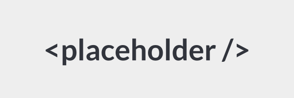

# Placeholder

**A simple image placeholder service.**



Placeholder allows you to generate **SVG, PNG, JPEG, GIF**, and **WebP** placeholder images for your projects with customizable sizes, formats, colors, text, and more.

## Features

- **Custom Sizes**: Specify width and height in the format `width x height`.
- **Multiple Formats**: Generate images in SVG, PNG, JPEG, GIF, or WebP.
- **Custom Colors**: Set background and text colors using **hex values** or **CSS color names**.
- **Custom Text and Fonts**: Add text to placeholders with optional font selection.
- **Retina Support**: Generate higher resolution images with `@2x` or `@3x` suffixes.

---

## Usage

### 1. Set Size
Use `width x height` to generate a placeholder of the desired size. 
- **Example**:

```
/600x400
```

- **Square Example**:

```
/400
```

*Supported sizes*:  
- **Minimum**: 10x10 px  
- **Maximum**: 4000x4000 px

---

### 2. Specify Image Format
Add the desired file format as a suffix.

- **Example PNG**:

```
/600x400/png
```

- **Example with Colors**:

```
/600x400/000000/FFFFFF/png
```

*Supported Formats*:  
- SVG (default)  
- PNG  
- JPEG  
- GIF  
- WebP  

---

### 3. Set Colors
Customize background and text colors using **hex codes** or **CSS color names**.

- **Example with Hex Values**:

```
/600x400/000000/FFF
```

- **Example with CSS Colors**:

```
/600x400/orange/white
```

---

### 4. Add Custom Text
Add text using a **query string**. Use `+` for spaces.

- **Example**:

```
/600x400?text=Hello+World
```

*Default Text*: Image dimensions (e.g., "600x400").

---

### 5. Select Font
Customize the font with a **query string**.

- **Example with Open Sans**:

```
/800?text=Hello+World&font=opensans
```

**Available Fonts**:
- Lato
- Lora
- Montserrat
- Open Sans
- Oswald
- Playfair Display
- PT Sans
- Raleway
- Roboto
- Source Sans 3

---

### 6. Retina Images
Generate higher resolution images with `@2x` or `@3x` suffixes.

- **Example @2x**:

```
/600x400@2x.png
```

- **Example @3x**:

```
/800@3x.png
```

*Supported Retina Formats*: PNG, JPEG, GIF, WebP

---

## License

This project is open-sourced software licensed under the [MIT license](./LICENSE).
